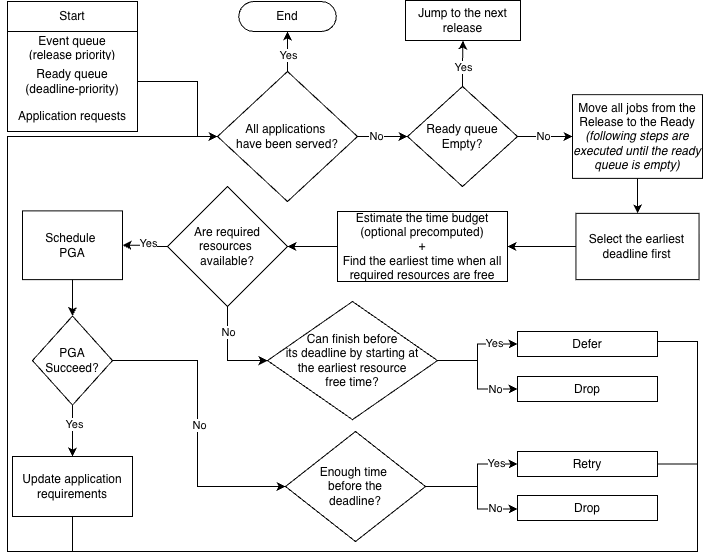
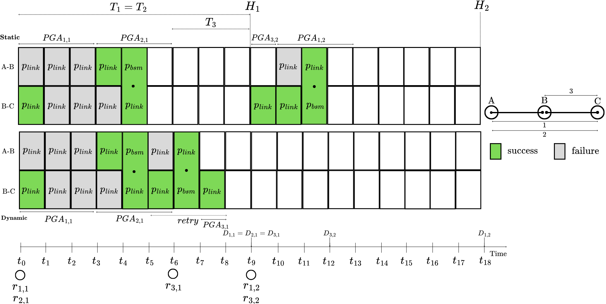
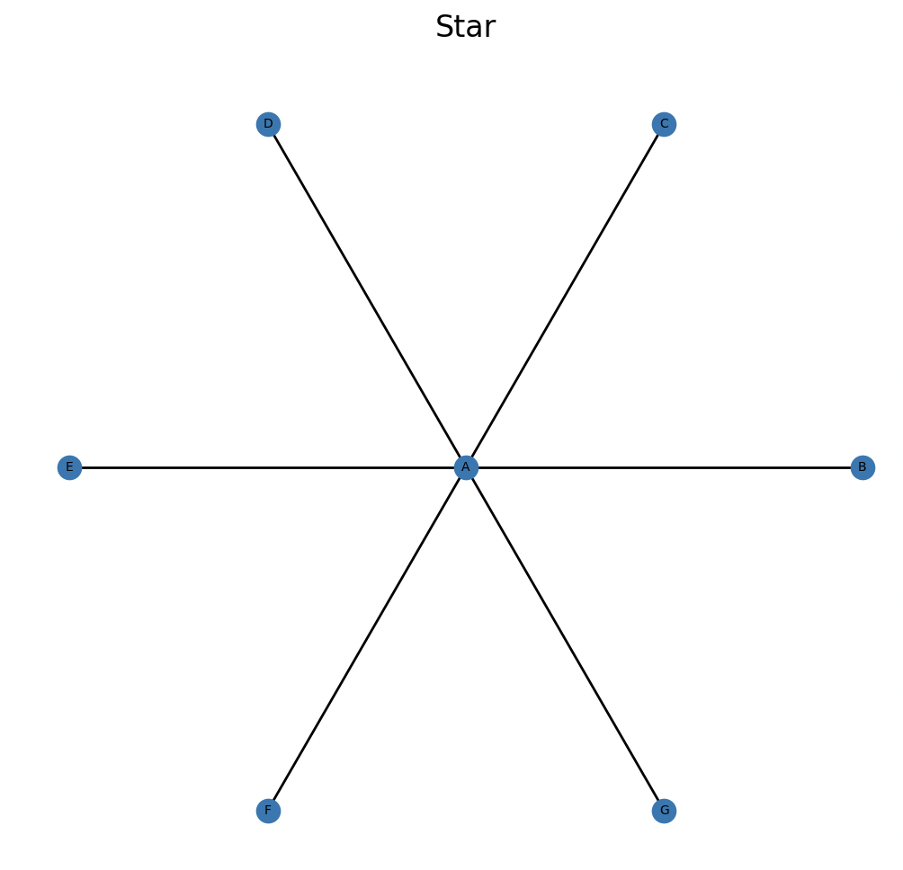
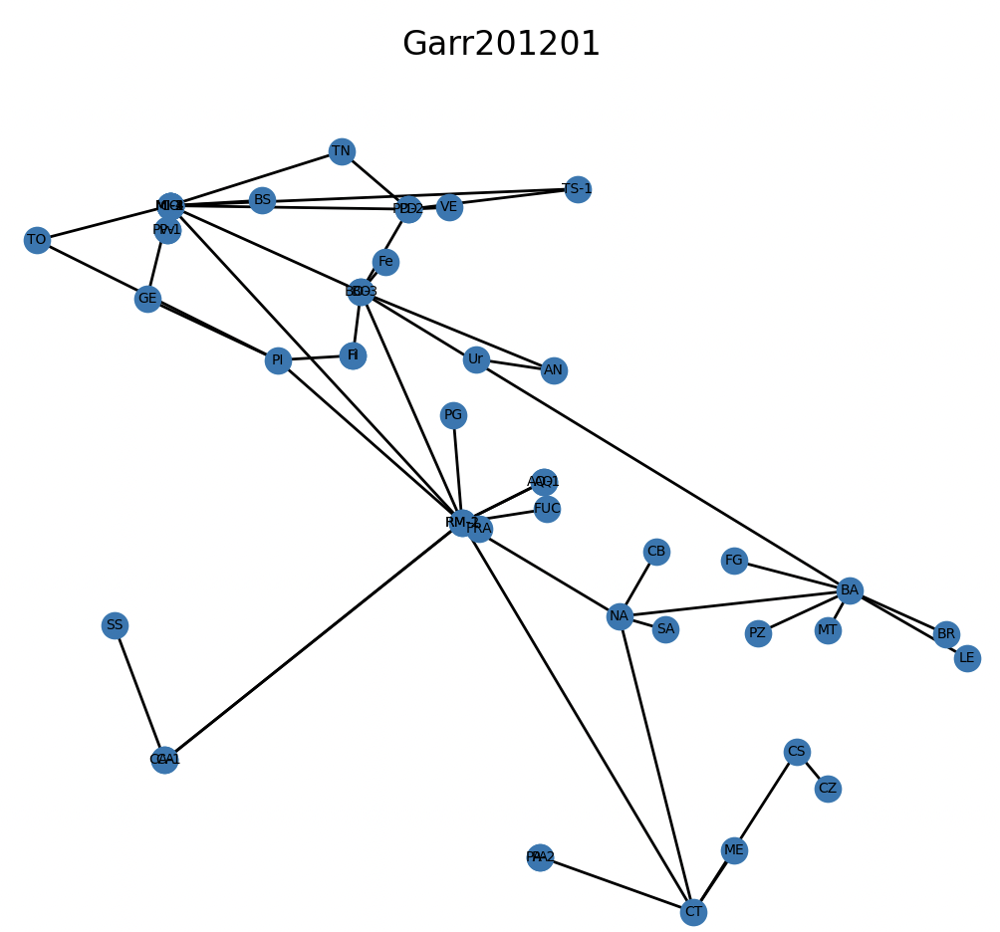

<p align="center">
  
</p>

<div align="center">


[](https://coveralls.io/r/Quang00/qnscheduling)

[](https://qnscheduling.readthedocs.io/en/latest/)

</div>

This repository simulates on-demand entanglement packet scheduling using Packet Generation Attempts (PGAs) from the paper [[1]](#1).

The simulator can:

- Generates a batch of applications (source/destination nodes, periods, number of packets, number of required EPR pairs)
- Computes the budget time per-application PGA based on a network-layer model/entanglement swapping
- Schedules PGAs with either a **static EDF timetable** or **dynamic online EDF-like**
- Runs a stochastic simulation of entanglement generation/swapping with link contention, and deferrals/retries/drops
- Exports results and summary metrics as CSVs

A high-level workflow of the dynamic scheduler of entanglement packets:

<p align="center">
  
</p>

A toy example of the network-layer model with the two schedulers (with a linear chain A-B-C) and 3 apps/flows (1, 2, 3):

<p align="center">
  
</p>

## Installation

1. **Create a Python Virtual Environment:**

```bash
python3 -m venv .venv
source .venv/bin/activate
python3 -m pip install -U pip
```

2. **Install the requirements**

```bash
pip install -r requirements.txt
```

3. **Verify the installation**

```bash
pytest
```

## Scheduling modes and statuses

### Static scheduler (`--scheduler static`)

- Builds a precomputed EDF schedule over a horizon.
- Uses a conflict graph for concurrency: applications that share at least one link cannot overlap.
- Feasibility checks:
  - Rejects any application with utilization $U = \frac{\text{duration}}{\text{period}} > 1$
  - Rejects schedules that would miss deadlines (`end > deadline`)

If infeasible, the run exits early (no result CSVs are written for that run).

### Dynamic scheduler (`--scheduler dynamic`)

- Online EDF-like with dynamic arrival.
- Arrivals are periodic by default; if `--arrival-rate` is provided, arrivals follow a Poisson process.
- Can admit/schedule/defer/retry/drop.

### Status values (in `pga_results.csv`)

- `completed`: generated required E2E EPR pairs within its budget time (PGA)
- `failed`: ran but didn’t generate enough pairs by the end of its PGA
- `retry`: failed attempt that is rescheduled again (dynamic)
- `defer`: could not start due to busy links, rescheduled to later (dynamic)
- `drop`: cannot start/finish by deadline constraints (dynamic)

## CLI options

Run `python -m scheduling.main --help` for the full list. Common flags:

- `--config`, `-c`: Path to a network topology `.gml` (default: `configurations/network/Dumbbell.gml`)
- `--apps`, `-a`: Number of applications to generate ($a$)
- `--inst MIN MAX`, `-i MIN MAX`: Range of number of required entanglement packets per application ($I_a$)
- `--epr MIN MAX`, `-e MIN MAX`: Range for EPR pairs requested per application ($q_a$)
- `--period MIN MAX`, `-p MIN MAX`: Range for application periods (seconds) ($T_a$)
- `--hyperperiod`, `-hp`: Number of hyperperiod ($H_i$) cycles to schedule/simulate (**static**)
- `--ppacket`, `-pp`: Target probability to compute PGA duration ($p_{packet}$)
- `--memory`, `-m`: Memory multiplexing number of independent link-generation trials per slot ($m$)
- `--pswap`, `-ps`: Bell State Measurement probability success ($p_{bsm}$)
- `--pgen`, `-pg`: EPR generation success probability per trial ($p_{gen}$)
- `--min-fidelity MIN MAX`, `-f MIN MAX`: Range for application minimum fidelity ($F_a$). If omitted, minimum fidelity is not considered.
- `--slot-duration`, `-sd`: Slot duration in seconds ($\tau$)
- `--routing`, `-r`: Routing scheme: `shortest` (Dijkstra) or `capacity` (capacity-aware)
- `--capacity-threshold`, `-ct`: Capacity threshold for routing capacity per link (**capacity**)
- `--scheduler`, `-sch`: Scheduling strategy: `static` or `dynamic`
- `--arrival-rate`, `-ar`: Mean arrival rate $\lambda$ for Poisson arrivals (**dynamic**). If omitted, arrivals are periodic.
- `--seed`, `-s`: RNG seed for reproducibility (NumPy)
- `--output`, `-o`: Output directory root (default: `results`)

## Output

Each run creates a new folder:

- `results/seed_<seed>/runN/`

Files written into the run folder:

- `app_requests.csv`: per-application request (source node, destination node, minimum fidelity, etc...)
- `link_utilization.csv`: per-link busy time and utilization over the observed makespan
- `link_waiting.csv`: per-link waiting totals, average waiting time, average queue length
- `params.csv`: parameters used for the run, plus runtime and run number
- `pga_results.csv`: per-attempt (PGA) logs (arrival/start/burst/completion/waiting/status, etc...)
- `summary.csv`: makespan, throughput, ratios, waiting stats, utilization stats, etc.
- `summary_per_app.csv`: per-application breakdown (counts of statuses + PGA duration)

## Network topologies

The network topology configurations are stored as `.gml` files in `configurations/network/`.

- `configurations/network/basic/`: Simple topologies
  - `Chain.gml`: Chain (5 nodes)
  - `Mesh.gml`: Mesh (6 nodes)
  - `Ring.gml`: Ring (7 nodes)
  - `Star.gml`: Star (7 nodes)
  - `Dumbbell.gml`: Dumbbell (8 nodes)
  - `Grid.gml`: Grid 5x5

- `configurations/network/advanced/`: Real-world network topologies from Internet Topology Zoo.

Each `.gml` file contains:

- **Graph metadata**: name, directed flag, statistics (nodes, links, degree)
- **Nodes**: id, label, longitude (lon), latitude (lat) for geographic positioning
- **Edges**: source, target, distance (dist)

### Visualizing topologies

To plot and visualize a network topology:

```bash
python -m utils/plots_graph.py
```

Then enter the path to the GML file (e.g., `configurations/network/basic/Star.gml`, `configurations/network/advanced/Garr201201.gml`).

| Basic                            | Advanced                            |
| -------------------------------- | ----------------------------------- |
|  |  |

## Quick Start

```bash
python -m scheduling.main
```

## Example commands

### Dynamic scheduler (online)

```bash
python -m scheduling.main \
  --config configurations/network/basic/Dumbbell.gml \
  --apps 2 \
  --inst 2 2 \
  --epr 2 2 \
  --period 10.0 10.0 \
  --ppacket 0.1 \
  --memory 50 \
  --pswap 0.95 \
  --pgen 0.001 \
  --min-fidelity 0.6 0.6 \
  --slot-duration 0.0001 \
  --seed 42 \
  --scheduler dynamic \
  --arrival-rate 1.0 \
  --output results
```

### Static scheduler (offline)

```bash
python -m scheduling.main \
  --config configurations/network/basic/Dumbbell.gml \
  --apps 2 \
  --inst 2 2 \
  --epr 2 2 \
  --period 10.0 10.0 \
  --hyperperiod 2 \
  --ppacket 0.1 \
  --memory 50 \
  --pswap 0.95 \
  --pgen 0.001 \
  --min-fidelity 0.6 0.6 \
  --slot-duration 0.0001 \
  --seed 42 \
  --scheduler static \
  --output results
```

### Dynamic scheduler + routing capacity-aware

```bash
python -m scheduling.main \
  --config configurations/network/basic/Dumbbell.gml \
  --apps 2 \
  --inst 2 2 \
  --epr 2 2 \
  --period 10.0 10.0 \
  --ppacket 0.1 \
  --memory 50 \
  --pswap 0.95 \
  --pgen 0.001 \
  --min-fidelity 0.6 0.6 \
  --slot-duration 0.0001 \
  --seed 42 \
  --routing capacity \
  --capacity-threshold 0.8 \
  --scheduler dynamic \
  --arrival-rate 1.0 \
  --output results
```

## Acknowledgements

The network topology configurations (`configurations/network/*.gml`) were obtained from **topohub** (https://github.com/piotrjurkiewicz/topohub) based on the Internet Topology Zoo, and are used here for research and simulation purposes.

## References

<a id="1">[1]</a>
T. R. Beauchamp, H. Jirovská, S. Gauthier and S. Wehner, "Extended Abstract: A Modular Quantum Network Architecture for Integrating Network Scheduling with Local Program Execution," IEEE INFOCOM 2025 - IEEE Conference on Computer Communications Workshops (INFOCOM WKSHPS), London, United Kingdom, 2025, pp. 1-7, doi: 10.1109/INFOCOMWKSHPS65812.2025.11152936.
