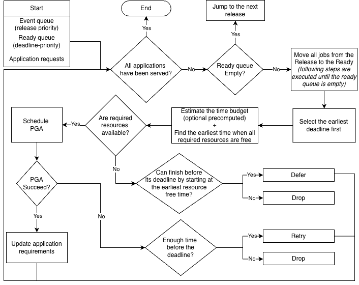
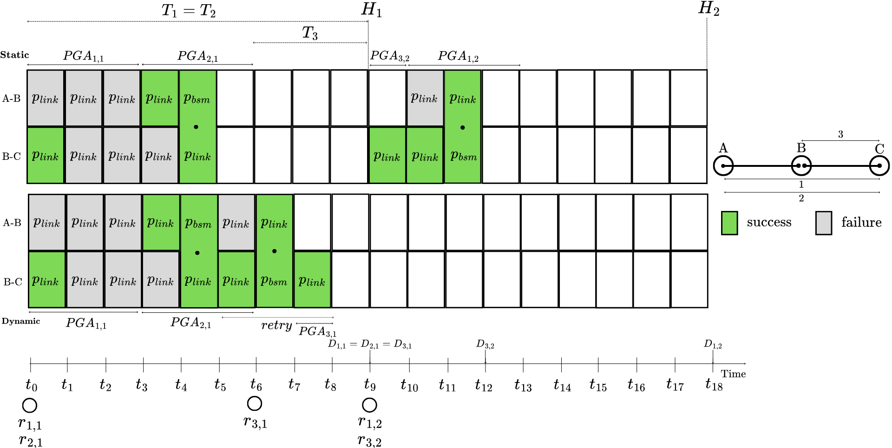
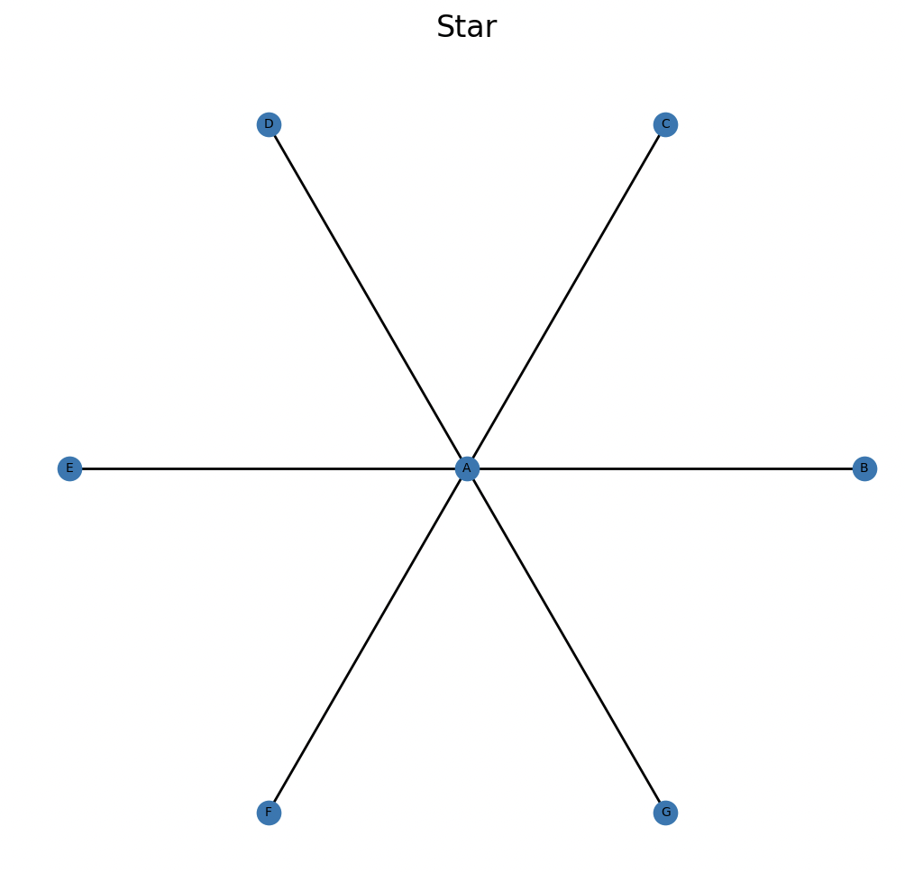
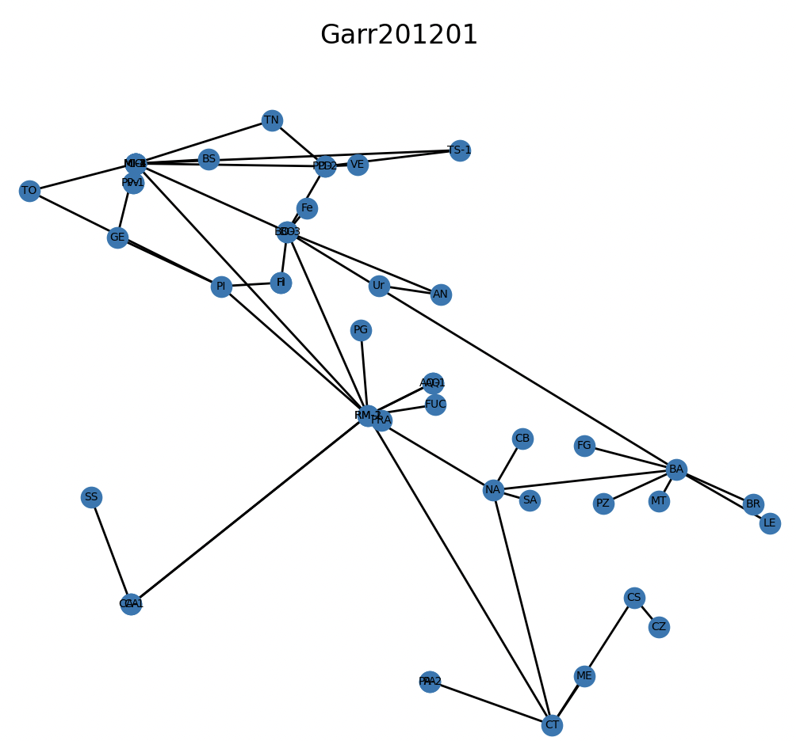

<p align="center">
  
</p>

<div align="center">


[](https://coveralls.io/r/Quang00/qnscheduling)

[](https://qnscheduling.readthedocs.io/en/latest/)

</div>

This repository implements on-demand entanglement packet scheduling using Packet Generation Attempts (PGAs) as described in [[1]](#1).

The simulator can:

- Generates a batch of applications (source/destination nodes, relative deadline budgets, number of packets per app, number of required EPR pairs per packet)
- Computes the budget time per-app PGA based on a network-layer model/entanglement swapping
- Schedules PGAs with either a **static EDF timetable** (deprecated) or **dynamic online EDF-like**
- Runs a discrete-event simulation of entanglement generation/swapping with link contention, and deferrals/retries/drops
- Exports results and summary metrics as CSVs/parquet files

A high-level workflow of the dynamic scheduler of entanglement packets:

<p align="center">
  
</p>

A toy example of the network-layer model with the two schedulers (with a linear chain A-B-C) and 3 apps/flows (1, 2, 3):

<p align="center">
  
</p>

## Installation

1. **Create a Python Virtual Environment:**

```bash
python3 -m venv .venv
source .venv/bin/activate
python3 -m pip install -U pip
```

2. **Install the requirements**

```bash
pip install -r requirements.txt
```

3. **Verify the installation**

```bash
pytest
```

## Scheduling modes and statuses

> [!IMPORTANT]
> Static scheduler is no longer supported. To reproduce the results from our paper "_Dynamic Entanglement Packet Scheduling for Quantum Networks_", please checkout to the commit ab9d3f057023a4494182af8b50f8d5bc2eeba6da.

### Static scheduler (deprecated)

- Builds a precomputed EDF schedule over a horizon.
- Uses a conflict graph for concurrency: applications that share at least one link cannot overlap.
- Feasibility checks:
  - Rejects any application with utilization $U = \frac{\text{duration}}{\text{period}} > 1$
  - Rejects schedules that would miss deadlines (`end > deadline`)

If infeasible, the run exits early (no result CSVs are written for that run).

### Dynamic scheduler

- Online EDF-like with dynamic arrival.
- Application releases are drawn from a Poisson process with rate `--arrival-rate` over the observation horizon [warmup, horizon].
- Can admit/schedule/defer/retry/drop.

### Status values (in `pga_results.parquet`)

- `completed`: generated required E2E EPR pairs within its budget time (PGA)
- `failed`: ran but didn’t generate enough pairs by the end of its PGA
- `retry`: failed attempt that is rescheduled again (dynamic)
- `drop`: cannot start/finish by deadline constraints (dynamic)

## CLI options

Run `python -m scheduling.main --help` for the full list. Common flags:

- `--config`, `-c`: Path to a network topology `.gml`.
- `--arrival-rate`, `-ar`: Mean arrival rate $\lambda$ for the Poisson process that releases applications. The number of applications is drawn from this rate over the observation horizon.
- `--inst MIN MAX`, `-i MIN MAX`: Range of number of releases per application ($I_a$)
- `--epr MIN MAX`, `-e MIN MAX`: Range for EPR pairs requested per application ($q_a$)
- `--deadline MIN MAX`, `-d MIN MAX`: Range for the per-application relative deadline budget (seconds); each instance's absolute deadline is `release + budget` ($D_a$)
- `--ppacket`, `-pp`: Target probability to compute PGA duration ($p_{packet}$)
- `--memory`, `-m`: Memory multiplexing number of independent link-generation trials per slot ($m$)
- `--pswap`, `-ps`: Bell State Measurement probability success ($p_{bsm}$)
- `--slot-duration`, `-sd`: Slot duration in seconds ($\tau$)
- `--routing`, `-r`: Routing scheme: `shortest` (Dijkstra), `smallest` (smallest bottleneck), `least` (least total capacity), `highest` (highest E2E fidelity)
- `--graph`, `-g`: Graph source: `gml` (use config file), `fat` (Fat tree) or `waxman` (generate random Waxman graph)
- `--seed`, `-s`: RNG seed for reproducibility (NumPy)
- `--output`, `-o`: Output directory root (default: `results`)

## Output

Each run creates a new folder:

- `results/seed_<seed>/runN/`

Files written into the run folder:

- `link_utilization.csv`: per-link busy time and utilization over the observed makespan
- `link_waiting.csv`: per-link waiting totals, average waiting time, average queue length
- `pga_results.parquet`: per-attempt (PGA) logs (arrival/start/burst/completion/waiting/status, etc...)
- `summary.csv`: makespan, throughput, ratios, waiting stats, utilization stats, etc.
- `params.json`: parameters used for the run, plus runtime and run number

## Network topologies

The network topology configurations are stored as `.gml` files in `configurations/network/`.

- `configurations/network/basic/`: Simple topologies
  - `Chain.gml`: Chain (5 nodes)
  - `Mesh.gml`: Mesh (6 nodes)
  - `Ring.gml`: Ring (7 nodes)
  - `Star.gml`: Star (7 nodes)
  - `Dumbbell.gml`: Dumbbell (8 nodes)
  - `Grid.gml`: Grid 5x5

- `configurations/network/advanced/`: Real-world network topologies from Internet Topology Zoo.

Each `.gml` file contains:

- **Graph metadata**: name, directed flag, statistics (nodes, links, degree)
- **Nodes**: id, label, longitude (lon), latitude (lat) for geographic positioning
- **Edges**: source, target, distance (dist)

### Visualizing topologies

To plot and visualize a network topology:

```bash
python -m utils.plots_graph
```

Then enter the path to the GML file (e.g., `configurations/network/basic/Star.gml`, `configurations/network/advanced/Garr201201.gml`).

| Basic                            | Advanced                            |
| -------------------------------- | ----------------------------------- |
|  |  |

## Example commands

### Dynamic scheduler (online)

```bash
python -m scheduling.main \
  -g gml \
  -c configurations/network/basic/2_equal_paths.gml \
  -i 100 \
  -e 2 2 \
  -d 2 2 \
  -pp 0.9 \
  -m 200 \
  -ps 0.6 \
  -sd 0.0001 \
  -s 42 \
  -ar 1.0 \
  -rs static \
  -r shortest
```

## Acknowledgements

The network topology configurations (`configurations/network/advanced/*.gml`) were obtained from **topohub** (https://github.com/piotrjurkiewicz/topohub) based on the Internet Topology Zoo, and are used here for research and simulation purposes.

## References

<a id="1">[1]</a>
T. R. Beauchamp, H. Jirovská, S. Gauthier and S. Wehner, "Extended Abstract: A Modular Quantum Network Architecture for Integrating Network Scheduling with Local Program Execution," IEEE INFOCOM 2025 - IEEE Conference on Computer Communications Workshops (INFOCOM WKSHPS), London, United Kingdom, 2025, pp. 1-7, doi: 10.1109/INFOCOMWKSHPS65812.2025.11152936.
